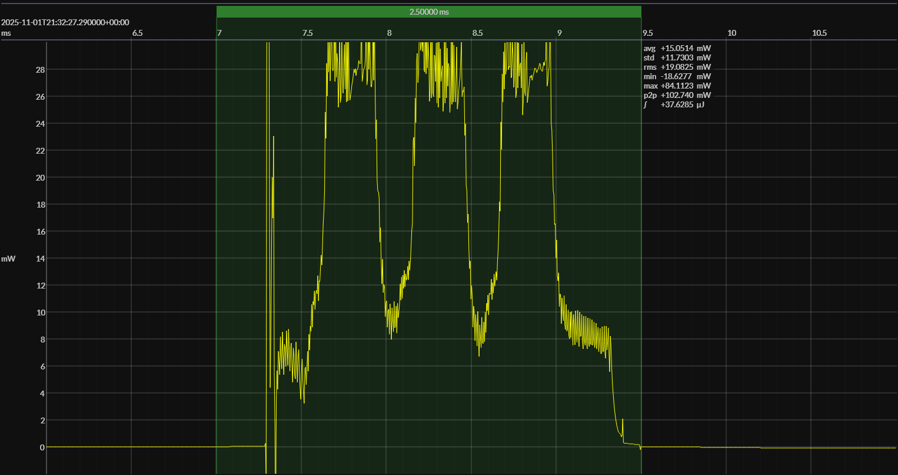

<h1 align="center">SiLabs EFR32xG24 · Simplicity (RAIL) · 3V0</h1>

<!-- @emscope-pack:start -->

<!-- *** AUTOMATICALLY GENERATED CONTENT – DO NOT EDIT *** -->  

captured on 2025-11-01 @ 16:49:08 generated on 2025-11-09 @ 13:59:38

## HW/SW Configuration

## EM&bull;Scope results · JS220

### 🟠&ensp;sleep

| supply voltage | &emsp;current (avg)&emsp; | &emsp;current (std)&emsp; | &emsp;average power&emsp;
|:---:|:---:|:---:|:---:|
| 3.0 V |  3.9 µA |  0.6 µA | 11.6 µW |

### 🟠&ensp;1&thinsp;s event period

| &emsp;&emsp;event energy (avg)&emsp;&emsp; | &emsp;&emsp;energy per period&emsp;&emsp; | &emsp;&emsp;energy per day&emsp;&emsp; | &emsp;&emsp;&emsp;**EM&bull;eralds**&emsp;&emsp;&emsp;
|:---:|:---:|:---:|:---:|
| 37.2 µJ | 48.8 µJ |  4.2 J | 18.98 |

### 🟠&ensp;10&thinsp;s event period

| &emsp;&emsp;event energy (avg)&emsp;&emsp; | &emsp;&emsp;energy per period&emsp;&emsp; | &emsp;&emsp;energy per day&emsp;&emsp; | &emsp;&emsp;&emsp;**EM&bull;eralds**&emsp;&emsp;&emsp;
|:---:|:---:|:---:|:---:|
| 37.2 µJ | 153.1 µJ |  1.3 J | 60.49 |

## Typical Event

## Notes

<!-- @emscope-pack:end -->

* power is _way_ too high; is DCDC enabled in SW
