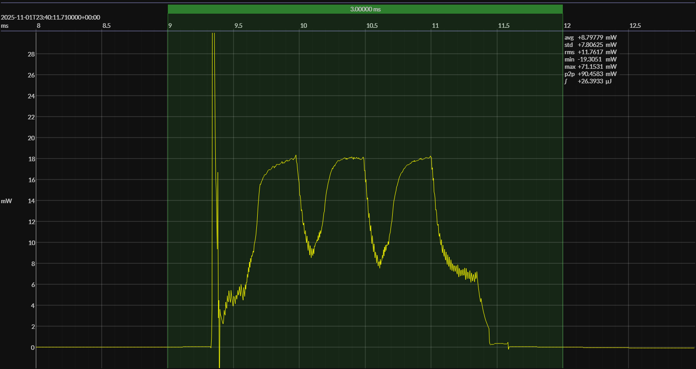

<h1 align="center">SiLabs EFR32xG27 · Simplicity (RAIL) · 3V0</h1>

<!-- @emscope-pack:start -->

<!-- *** AUTOMATICALLY GENERATED CONTENT – DO NOT EDIT *** -->  

captured on 2025-11-01 @ 23:39:00 generated on 2025-11-09 @ 13:59:39

## HW/SW Configuration

## EM&bull;Scope results · JS220

### 🟠&ensp;sleep

| supply voltage | &emsp;current (avg)&emsp; | &emsp;current (std)&emsp; | &emsp;average power&emsp;
|:---:|:---:|:---:|:---:|
| 3.0 V |  2.5 µA |  0.7 µA |  7.5 µW |

### 🟠&ensp;1&thinsp;s event period

| &emsp;&emsp;event energy (avg)&emsp;&emsp; | &emsp;&emsp;energy per period&emsp;&emsp; | &emsp;&emsp;energy per day&emsp;&emsp; | &emsp;&emsp;&emsp;**EM&bull;eralds**&emsp;&emsp;&emsp;
|:---:|:---:|:---:|:---:|
| 26.0 µJ | 33.5 µJ |  2.9 J | 27.61 |

### 🟠&ensp;10&thinsp;s event period

| &emsp;&emsp;event energy (avg)&emsp;&emsp; | &emsp;&emsp;energy per period&emsp;&emsp; | &emsp;&emsp;energy per day&emsp;&emsp; | &emsp;&emsp;&emsp;**EM&bull;eralds**&emsp;&emsp;&emsp;
|:---:|:---:|:---:|:---:|
| 26.0 µJ | 101.4 µJ |  0.9 J | 91.28 |

## Typical Event

## Notes

<!-- @emscope-pack:end -->

* not sure DCDC is enabled
