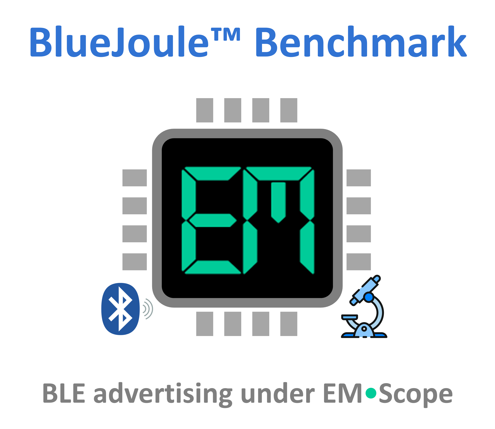

<!-- @upd|2026-03-19|new scores &ndash; SiLabs EFR32xG24 and EFR32xG27 · Simplicity (RAIL)|-->

<!-- @entry|sil-g24-ek/rail-3V0-J| -->
<!-- @entry|sil-g27-dk/rail-3V0-J| -->

<!-- @medal|1|sil-g27-dk/rail-3V0-J|G| -->
<!-- @medal|1|sil-g24-ek/rail-3V0-J|S| -->

<!-- @medal|10|sil-g27-dk/rail-3V0-J|G| -->
<!-- @medal|10|sil-g24-ek/rail-3V0-J|S| -->


<p align="center">
    
</p>

---

<a id="toc"></a>

<h3 align="center">
  <a href="#application">Application</a>&nbsp;&#xFF5C;&nbsp;
  <a href="#catalog">Catalog</a>&nbsp;&#xFF5C;&nbsp;
  <a href="#scores">Scores</a>&nbsp;&#xFF5C;&nbsp;
  <a href="#contributing">Contributing</a>
</h3>

<br>

This repository uses **EM&bull;Scope** to benchmark **BlueJoule** &ndash; a representative **Bluetooth Low Energy** [BLE] application executing on a wide-range of HW/SW platforms.&thinsp; Visit the [em-foundation/emscope](https://github.com/em-foundation/emscope/blob/docs-stable/docs/ReadMore.md) project to learn more about the **EM&bull;Scope** tool itself.

<h4 align=“left”>MEDALISTS&emsp;🥇 · 🥈 · 🥉</h4>

<!-- @medals-begin -->
<details open><summary>&emsp;&ensp;1&thinsp;s event period&thinsp; [<b>EMeralds</b>]</summary><p>
&nbsp;&nbsp;&nbsp;&nbsp;&nbsp;&nbsp;&nbsp;&nbsp;&nbsp;&nbsp;&nbsp;&nbsp;&nbsp;&nbsp;&nbsp;&nbsp;&nbsp;&nbsp;&nbsp;&nbsp;&nbsp;&nbsp;&nbsp;&nbsp;&nbsp;<b>🥇</b>&nbsp;&nbsp;&nbsp;&nbsp;&nbsp;&nbsp;&nbsp;&nbsp;&nbsp;&nbsp;&nbsp;&nbsp;<code> 27.61</code>&nbsp;&nbsp;&nbsp;&nbsp;&nbsp;&nbsp;&nbsp;&nbsp;&nbsp;&nbsp;&nbsp;&nbsp;📄&ensp;<a href="../captures/sil-g27-dk/rail-3V0-J/ABOUT.md">&nearr;</a>&nbsp;&nbsp;&nbsp;SiLabs EFR32xG27 · Simplicity (RAIL) · 3V0<br>
&nbsp;&nbsp;&nbsp;&nbsp;&nbsp;&nbsp;&nbsp;&nbsp;&nbsp;&nbsp;&nbsp;&nbsp;&nbsp;&nbsp;&nbsp;&nbsp;&nbsp;&nbsp;&nbsp;&nbsp;&nbsp;&nbsp;&nbsp;&nbsp;&nbsp;<b>🥈</b>&nbsp;&nbsp;&nbsp;&nbsp;&nbsp;&nbsp;&nbsp;&nbsp;&nbsp;&nbsp;&nbsp;&nbsp;<code> 18.98</code>&nbsp;&nbsp;&nbsp;&nbsp;&nbsp;&nbsp;&nbsp;&nbsp;&nbsp;&nbsp;&nbsp;&nbsp;📄&ensp;<a href="../captures/sil-g24-ek/rail-3V0-J/ABOUT.md">&nearr;</a>&nbsp;&nbsp;&nbsp;SiLabs EFR32xG24 · Simplicity (RAIL) · 3V0<br>

</p></details>
<details open><summary>&emsp;10&thinsp;s event period&thinsp; [<b>EMeralds</b>]</summary><p>
&nbsp;&nbsp;&nbsp;&nbsp;&nbsp;&nbsp;&nbsp;&nbsp;&nbsp;&nbsp;&nbsp;&nbsp;&nbsp;&nbsp;&nbsp;&nbsp;&nbsp;&nbsp;&nbsp;&nbsp;&nbsp;&nbsp;&nbsp;&nbsp;&nbsp;<b>🥇</b>&nbsp;&nbsp;&nbsp;&nbsp;&nbsp;&nbsp;&nbsp;&nbsp;&nbsp;&nbsp;&nbsp;&nbsp;<code> 91.28</code>&nbsp;&nbsp;&nbsp;&nbsp;&nbsp;&nbsp;&nbsp;&nbsp;&nbsp;&nbsp;&nbsp;&nbsp;📄&ensp;<a href="../captures/sil-g27-dk/rail-3V0-J/ABOUT.md">&nearr;</a>&nbsp;&nbsp;&nbsp;SiLabs EFR32xG27 · Simplicity (RAIL) · 3V0<br>
&nbsp;&nbsp;&nbsp;&nbsp;&nbsp;&nbsp;&nbsp;&nbsp;&nbsp;&nbsp;&nbsp;&nbsp;&nbsp;&nbsp;&nbsp;&nbsp;&nbsp;&nbsp;&nbsp;&nbsp;&nbsp;&nbsp;&nbsp;&nbsp;&nbsp;<b>🥈</b>&nbsp;&nbsp;&nbsp;&nbsp;&nbsp;&nbsp;&nbsp;&nbsp;&nbsp;&nbsp;&nbsp;&nbsp;<code> 60.49</code>&nbsp;&nbsp;&nbsp;&nbsp;&nbsp;&nbsp;&nbsp;&nbsp;&nbsp;&nbsp;&nbsp;&nbsp;📄&ensp;<a href="../captures/sil-g24-ek/rail-3V0-J/ABOUT.md">&nearr;</a>&nbsp;&nbsp;&nbsp;SiLabs EFR32xG24 · Simplicity (RAIL) · 3V0<br>

</p></details>
<!-- @medals-end -->

<h4>LATEST UPDATES &emsp;&emsp;&emsp;&emsp;<sub><i>click below</i> ▶ <i>to expand</i> ▼</sub></h4>

<!-- @updates-begin -->
<details><summary>
&emsp;&thinsp;</img>&emsp;new scores &ndash; SiLabs EFR32xG24 and EFR32xG27 · Simplicity (RAIL)</summary><p>

</p></details>
<!-- @updates-end -->

<p align="right"><sub>
  🕒
<!-- @timestamp-begin -->
260324150338
<!-- @timestamp-end -->
  &thinsp;&ratio;&thinsp;
  💻 <a href="https://vimeo.com/1143876573/ea5b01d4fa?fl=ip&fe=ec__s=h1i6g41pfmvr9sn57rsi&utm_source=drip&utm_medium=email&utm_campaign=BlueJoule+Webinar+Recording&utm_content=BlueJoule+Webinar+Recording+%28Attended%29">Webinar</a>
  ⭐ <a href="https://github.com/em-foundation/BlueJoule">Star</a>
  👁️ <a href="https://github.com/em-foundation/BlueJoule/subscription">Watch</a>
  📡 <a href="https://github.com/em-foundation/BlueJoule/commits/main.atom">RSS</a>
</sub></p>

----

## Application

Repetitive advertising serves as a fundamental capability of any Bluetooth Low Energy application.&thinsp; Because of its inherent simplicity, programs illustrating the [BLE broadcaster role](https://novelbits.io/bluetooth-low-energy-advertisements-part-1/) often serve as the "Hello World" within this space.

### Benchmark Specification

The following table summarizes the key parameters of the **BlueJoule** advertising benchmark:

| Parameter | Value | Notes |
|-----------|-------|-------|
| TX Power | 0&thinsp;dBm | Standard reference power for fair comparison |
| PHY | LE 1M | Legacy advertising uses 1&thinsp;Mbps uncoded PHY |
| Advertising Type | Non-connectable, non-scannable | `ADV_NONCONN_IND` PDU type |
| Advertising Interval | 1&thinsp;s (1000&thinsp;ms) | Time between advertising events |
| Advertising Channels | 37, 38, 39 | All three primary advertising channels |
| Payload Size | 19 bytes | See payload breakdown below |

### Advertising Channels

The **BlueJoule** benchmark transmits on all three primary Bluetooth LE advertising channels:

| Channel | Frequency | Purpose |
|:-------:|-----------|---------|
| 37 | 2402&thinsp;MHz | Primary advertising channel |
| 38 | 2426&thinsp;MHz | Primary advertising channel |
| 39 | 2480&thinsp;MHz | Primary advertising channel |

These transmissions occur back-to-back within a single _advertising event_; and these events will unfold at a 1&thinsp;s _advertising interval_.

### TX Power

To facilitate "apples-to-apples" comparisons among different platforms, we require the underlying BLE radio to transmit packets at 0&thinsp;dBm.&thinsp; A differentiator for HW vendors, TX power consumption in `mW` will often headline their datasheets.

### Advertising Type

We require packet transmission to use _non-connectable · non-scannable_ advertising, designated by the standard `ADV_NONCONN_IND` PDU type code found in the packet's header.&thinsp; This advertising type:

- Does not allow connections from central devices
- Does not respond to scan requests
- Minimizes energy consumption per advertising event
- Represents a pure broadcast scenario

### Advertising Payload

The advertising data comprises 19 bytes of payload defined with the following BLE data types:

| Len | Type | Data (hex)                                   | Notes                                         |
|----:|-----:|----------------------------------------------|-----------------------------------------------|
| `02`  |  `01`  | `06`                                     | Flags &mdash; LE General Disc + BR/EDR not supported      |
| `0A`  |  `08`  | `42 6C 75 65 4A 6F 75 6C 65`             | Local Name &mdash; `"BlueJoule"`             |
| `04`  |  `FF`  | `D3 08 FF`                               | Manufacturer &mdash; Company:&thinsp; [Novel Bits](https://novelbits.io/) (`0x08D3`),&thinsp; Data: `0xFF`&emsp; |

When _not_ actively advertising &ndash; over 99% of the time, in fact, within a 1&thinsp;s event period &ndash; we presume that the application has entered some "deep-sleep" mode to minimize power consumption.

## Catalog

This repository catalogs an inventory of **EM&bull;Scope** capture directories &ndash; each populated using the `emscope grab` command with either its `-J, --js220` or its `-P, --ppk2` option while powering the target hardware at a designated voltage.

An `ABOUT.md` file found in each directory describes the capture's HW/SW configuration in greater deetail as well as summarizes its benchmark scores.&thinsp; This file also contains a screen-shot of a typical advertising event, prepared using the `emscope view` command.

<h4 align=“left”>CAPTURE INVENTORY&emsp;<sub><i>click below</i> ▶ <i>to expand</i> ▼</sub></h4>

<a id="capture-inventory"></a>
<details><summary>&nbsp;</summary>

<!-- @catalog-begin -->
| &emsp;Capture&emsp;&emsp;&emsp;&emsp; | &emsp;JS220&emsp; | &emsp;PPK2&nbsp;&emsp; | &emsp;&emsp;&emsp;&emsp;&emsp;&emsp;&emsp;Description&emsp;&emsp;&emsp;&emsp;&emsp;&emsp;&emsp;&emsp;&emsp;&emsp;&emsp;&emsp;&emsp;&emsp;&emsp;&emsp;&emsp; |
|---|:---:|:---:|---|
| `sil-g24-ek/rail-3V0`&emsp; | 📄&ensp;<a href="../captures/sil-g24-ek/rail-3V0-J/ABOUT.md">&nearr;</a> |  | &emsp; SiLabs EFR32xG24 · Simplicity (RAIL) · 3V0 |
| `sil-g27-dk/rail-3V0`&emsp; | 📄&ensp;<a href="../captures/sil-g27-dk/rail-3V0-J/ABOUT.md">&nearr;</a> |  | &emsp; SiLabs EFR32xG27 · Simplicity (RAIL) · 3V0 |
<!-- @catalog-end -->

</details>

> [!TIP]
> We recommend opening any &thinsp;&nearr;&thinsp; links in this collapsible table through a new **Tab** or **Window** within your browser

## Scores

The following table presents a curated collection of capture results drawn from the **BlueJoule** catalog &ndash; summarizing _sleep current_&thinsp;, _event energy_&thinsp;, and a pair of **EM&bull;erald** scores for each entry.&thinsp;

> [!NOTE]
> By way of review, **EM&bull;eralds** quantify _energy efficiency_ &ndash; with higher scores implying lower energy consumption per period:
>
><p align="left"><b><sup>&emsp;&emsp;&emsp;&emsp;&emsp;&emsp;EM•eralds = 2400 ÷ (<i>Joules per day</i> × 30) = 80 ÷ <i>Joules per day</i><br>&emsp;&emsp;&emsp;&emsp;&emsp;&emsp;CR2032 energy:&nbsp; 225 mAh × 3.6 × 3.0 V ≈ 2.43 kJ<br>&emsp;&emsp;&emsp;&emsp;&emsp;&emsp;1 EM•erald ≈ 1 CR2032-month</sup></b></p>

To keep the table manageable in size, we've applied the following filter criteria when selecting individual entries:

🟠 &ensp; recorded with a JouleScope JS220 high-precision energy analyzer<br>
🟠 &ensp; features vendor-supported SW running on off-the-shelf HW<br>
🟠 &ensp; powered at an optimal voltage for the underlying silicon

> [!TIP]
> Hovering over individual capture links within the following table provides an unabbreviated description of the target HW/SW configu&shy;ration.&thinsp; Each of these links will then take you to a screen-shot of typical advertising event.

<!-- @scores-begin -->
<a name="entry-scores"></a><p align="center"></p>
    
| &emsp;Capture&emsp;&emsp;&emsp;&emsp; | sleep current [&thinsp;&mu;A&thinsp;] | event energy [&thinsp;&mu;J&thinsp;] | 1&thinsp;s period [] | 10&thinsp;s period [] |
|---|:---:|:---:|:---:|:---:|
| `sil-g24-ek/rail-3V0         `&nbsp;📈&nbsp;[&nbsp;&nearr;](../captures/sil-g24-ek/rail-3V0-J/ABOUT.md#typical-event "SiLabs EFR32xG24 · Simplicity (RAIL) · 3V0") | <code> 3.9</code> | <code> 37.2</code> | <code> 18.98</code> | <code> 60.49</code> |
| `sil-g27-dk/rail-3V0         `&nbsp;📈&nbsp;[&nbsp;&nearr;](../captures/sil-g27-dk/rail-3V0-J/ABOUT.md#typical-event "SiLabs EFR32xG27 · Simplicity (RAIL) · 3V0") | <code> 2.5</code> | <code> 26.0</code> | <code> 27.61</code> | <code> 91.28</code> |


<p>&nbsp;</p>
<h4 align="left">ALL JS220 SCORES&emsp;<sub><i>click below</i> ▶ <i>to expand</i> ▼</sub></h4>

<a id="js220-scores"></a>
<details><summary>&nbsp;</summary>

    
| &emsp;Capture&emsp;&emsp;&emsp;&emsp; | sleep current [&thinsp;&mu;A&thinsp;] | event energy [&thinsp;&mu;J&thinsp;] | 1&thinsp;s period [] | 10&thinsp;s period [] |
|---|:---:|:---:|:---:|:---:|
| `sil-g24-ek/rail-3V0         `&nbsp;📈&nbsp;[&nbsp;&nearr;](../captures/sil-g24-ek/rail-3V0-J/ABOUT.md#typical-event "SiLabs EFR32xG24 · Simplicity (RAIL) · 3V0") | <code> 3.9</code> | <code> 37.2</code> | <code> 18.98</code> | <code> 60.49</code> |
| `sil-g27-dk/rail-3V0         `&nbsp;📈&nbsp;[&nbsp;&nearr;](../captures/sil-g27-dk/rail-3V0-J/ABOUT.md#typical-event "SiLabs EFR32xG27 · Simplicity (RAIL) · 3V0") | <code> 2.5</code> | <code> 26.0</code> | <code> 27.61</code> | <code> 91.28</code> |

</details>

<h4 align="left">ALL PPK2 SCORES&nbsp;&emsp;<sub><i>click below</i> ▶ <i>to expand</i> ▼</sub></h4>

<a id="ppk2-scores"></a>
<details><summary>&nbsp;</summary>

    
| &emsp;Capture&emsp;&emsp;&emsp;&emsp; | sleep current [&thinsp;&mu;A&thinsp;] | event energy [&thinsp;&mu;J&thinsp;] | 1&thinsp;s period [] | 10&thinsp;s period [] |
|---|:---:|:---:|:---:|:---:|

</details>
<!-- @scores-end -->

<p>&nbsp;</p>

> [!TIP]
> Consider installing the [open-source](https://github.com/em-foundation/emscope/blob/docs-stable/docs/ReadMore.md) **EM&bull;Scope** tool, whose `emscope view --what-if` command allows you to query _other_ event period durations more relevant to your particular application.
>
> The `emscope view --jls-file` command also allows you to interactively explore any of the data captures in the **BlueJoule** catalog using the [**Joulescope File Viewer**](https://www.joulescope.com/pages/downloads) &ndash; without requiring a power analyzer.

## Contributing

To contribute new captures (or to refine existing captures), fork this repository and then submit a pull request (PR) for our consideration.&thinsp; Needless to say, we presume prior experience with the [`emscope`](https://github.com/em-foundation/emscope) command-line tool.

> [!TIP]
> Use this command sequence when locally cloning your fork of this repo:
>
>```
> $ GIT_LFS_SKIP_SMUDGE=1 git clone --filter=blob:none https://github.com/<USER-NAME>/<FORKED-REPO-NAME>
> $ cd <FORKED-REPO-NAME>
> $ git lfs install --local --skip-smudge
>```
>From here, you can use `emscope pack -u` to deflate `emscope-capture.zip` files locally as needed.

If you plan to submit a new capture, create a directory whose name follows the labeling conventions used throughout this repo.&thinsp; Copy an existing capture's `ABOUT.md` file into your new directory, and then modify this file's contents accordingly.

For any technical questions or roadmap suggestions, create a new thread on our [discussions](https://github.com/em-foundation/BlueJoule/discussions/) page.

